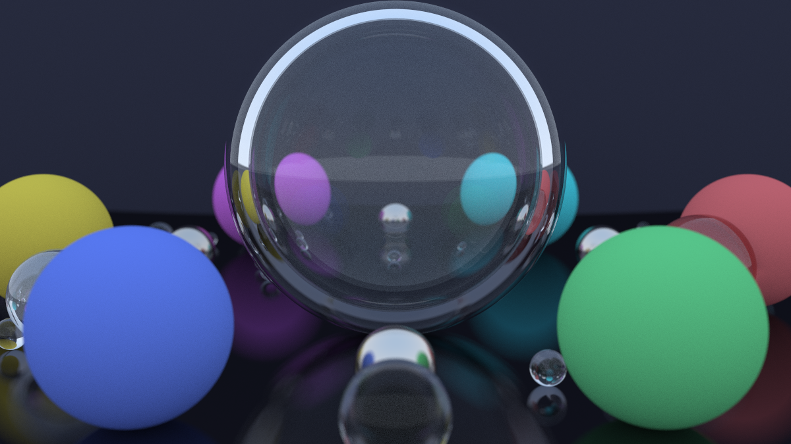

A baseline implementation of a path tracer as a good excuse to learn Rust. Nothing outworldly to see, just some simple sphere rendering inspired by [*Ray Tracing in One Weekend*](https://raytracing.github.io/books/RayTracingInOneWeekend.html).
Check out this unnecessarily suspicious orrery... 

